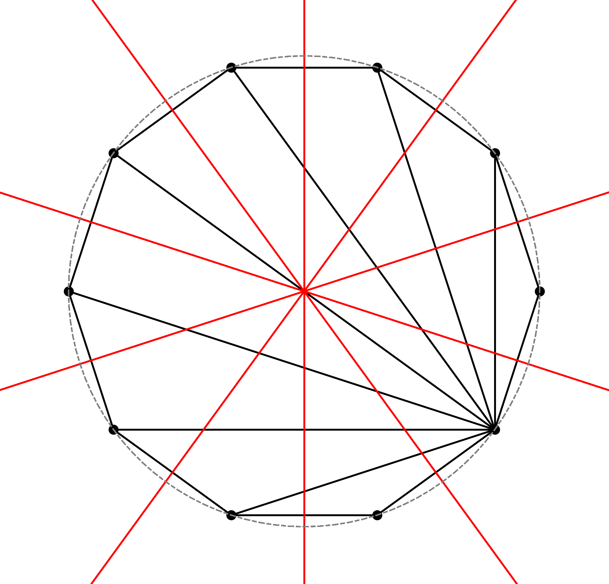

## Konstrukcja diagramu Woronoja
### Opis programu
Repozytorium zawiera notatnik Jupyter, w którym zaimplementowano dwa algorytmy obliczające diagram Woronoja zadanej chmury punktów:

* algorytm Boweyera-Watsona obliczający triangulację Delaunay'a zadanej chmury
punktów, a następnie na jej podstawie obliczający diagram Woronoja dualny do tej
triangulacji;

* algorytm przybliżony brute-force, który wprowadza dyskretną kratę ℤ^2 na
płaszczyźnie i dla każdego punktu kratowego znajduje punkt chmury najmniej od
niego oddalony.

Notatnik zawiera również metody do wizualizacji wyników algorytmów oraz
interaktywną wizualizację poszczególnych etapów działania algorytmu
Bowyera-Watsona. W folderze [report](report) znajduje się sprawozdanie z
projektu oraz prezentacja.

### Przykładowe wyniki

